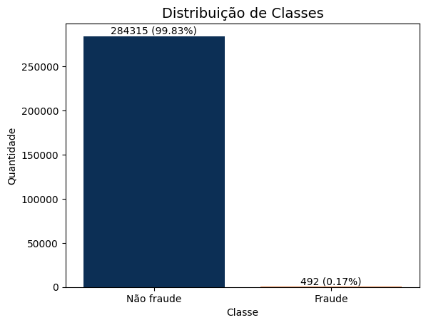
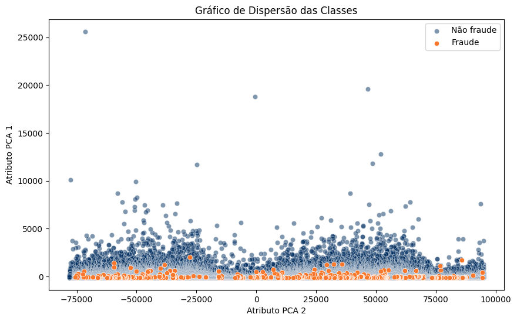
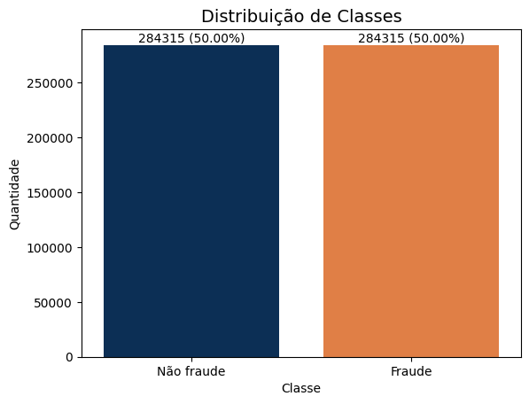
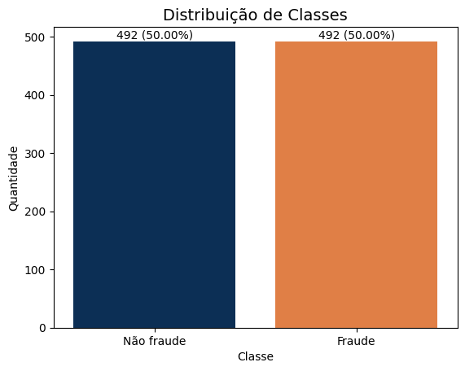

# 1. Informações do dataset Credit Card Fraud Detection e das Análises e Métodos de Data Science

## 1.1. Sumário

- [1. Informações do dataset Credit Card Fraud Detection e das Análises e Métodos de Data Science](#1-informações-do-dataset-credit-card-fraud-detection-e-das-análises-e-métodos-de-data-science)
  - [1.1. Sumário](#11-sumário)
  - [1.2. Informações do Dataset](#12-informações-do-dataset)
  - [1.3. Métodos e Análises de Data Science](#13-métodos-e-análises-de-data-science)
    - [1.3.1. Métodos de Balanceamento de Classes](#131-métodos-de-balanceamento-de-classes)
      - [1.3.1.1. Possíveis Visualizações](#1311-possíveis-visualizações)
        - [1.3.1.1.1. Gráfico de Barras](#13111-gráfico-de-barras)
        - [1.3.1.1.2. Gráfico de Dispersão (Scatter Plot)](#13112-gráfico-de-dispersão-scatter-plot)
      - [1.3.1.2. Amostragem Aleatória de Sobreamostragem (Random Over Sampling)](#1312-amostragem-aleatória-de-sobreamostragem-random-over-sampling)
      - [1.3.1.3. Amostragem Aleatória de Subamostragem (Random Under Sampling)](#1313-amostragem-aleatória-de-subamostragem-random-under-sampling)
      - [1.3.1.4. SMOTE (Synthetic Minority Over-sampling Technique)](#1314-smote-synthetic-minority-over-sampling-technique)
      - [1.3.1.5. Borderline SMOTE](#1315-borderline-smote)
      - [1.3.1.6. ADASYN (Adaptive Synthetic Sampling)](#1316-adasyn-adaptive-synthetic-sampling)
    - [1.3.2. Detecção de Anomalias](#132-detecção-de-anomalias)
    - [1.3.3. Análises Superficiais](#133-análises-superficiais)
    - [1.3.4. Machine Learning](#134-machine-learning)

## 1.2. Informações do Dataset

O conjunto de dados de fraude de cartão de crédito no Kaggle é um conjunto de dados altamente desequilibrado que contém transações feitas por cartões de crédito em setembro de 2013 por titulares de cartões europeus. Este conjunto de dados apresenta transações que ocorreram em dois dias, onde temos 492 fraudes de 284.807 transações. O conjunto de dados é altamente desequilibrado, a classe positiva (fraudes) é de 0,172% de todas as transações.

Ele contém apenas variáveis de entrada numéricas que são o resultado de uma transformação PCA. Infelizmente, devido a questões de confidencialidade, não são fornecidas as características originais e mais informações básicas sobre os dados. As características V1, V2, ... V28 são os principais componentes obtidos com o PCA, as únicas características que não foram transformadas com o PCA são 'Time' e 'Amount'. A característica 'Time' contém os segundos decorridos entre cada transação e a primeira transação no conjunto de dados. A característica 'Amount' é a quantidade da transação, essa característica pode ser usada para aprendizado sensível ao custo dependente do exemplo. A característica 'Class' é a variável de resposta e leva o valor 1 em caso de fraude e 0 em caso contrário.

## 1.3. Métodos e Análises de Data Science

### 1.3.1. Métodos de Balanceamento de Classes

O balanceamento de classes é uma técnica crucial no aprendizado de máquina, especialmente em cenários onde estamos lidando com conjuntos de dados desequilibrados. Um conjunto de dados é considerado desequilibrado quando as distribuições de classes não são aproximadamente iguais. Em outras palavras, um conjunto de dados desequilibrado tem uma classe majoritária (ou classes) e uma classe minoritária (ou classes) com proporções significativamente diferentes.

A importância do balanceamento de classes é evidente em muitos cenários do mundo real. Por exemplo, na detecção de fraude de cartão de crédito, a classe de "fraude" é geralmente a classe minoritária (uma pequena proporção de todas as transações são fraudulentas), enquanto a classe de "não fraude" é a classe majoritária. Se o modelo for treinado em um conjunto de dados desequilibrado, ele pode se tornar tendencioso para a classe majoritária, resultando em um grande número de falsos negativos. Em outras palavras, o modelo pode falhar em detectar muitos casos de fraude, o que é um resultado indesejável.

O balanceamento de classes ajuda a mitigar este problema, garantindo que o modelo de aprendizado de máquina seja exposto a uma proporção adequada de exemplos de cada classe. Isso pode ser feito de várias maneiras, incluindo sobreamostragem da classe minoritária, subamostragem da classe majoritária, ou gerando exemplos sintéticos da classe minoritária.

No entanto, é importante notar que o balanceamento de classes não é sempre necessário e pode, às vezes, até prejudicar o desempenho do modelo. Por exemplo, em alguns casos, a classe minoritária pode ser de interesse, mas não necessariamente mais importante que a classe majoritária. Além disso, o balanceamento de classes pode levar a um sobreajuste na classe minoritária se não for feito corretamente.

Em resumo, o balanceamento de classes é uma técnica importante para lidar com conjuntos de dados desequilibrados, mas deve ser aplicado com cuidado, levando em consideração o contexto específico e os objetivos do problema de aprendizado de máquina.

#### 1.3.1.1. Possíveis Visualizações

A visualização de dados é uma parte fundamental da análise de dados e pode ser particularmente útil ao lidar com problemas de balanceamento de classes. Aqui estão algumas visualizações de gráficos que podem ser úteis:

##### 1.3.1.1.1. Gráfico de Barras

Um gráfico de barras é uma forma eficaz de comparar itens entre diferentes grupos. Este tipo de gráfico é uma maneira fácil de interpretar e representar dados categorizados. No contexto do balanceamento de classes, um gráfico de barras pode ser usado para visualizar a quantidade de instâncias em cada classe. Isso pode ajudar a identificar rapidamente se um conjunto de dados está desequilibrado.

Cada barra no gráfico representa uma classe, e a altura da barra é proporcional ao número de instâncias dessa classe. Assim, é fácil ver qual classe tem mais instâncias (a classe majoritária) e qual tem menos (a classe minoritária).

##### 1.3.1.1.2. Gráfico de Dispersão (Scatter Plot)

Um gráfico de dispersão é um diagrama onde cada valor do conjunto de dados é representado por um ponto. Este tipo de gráfico pode ser útil para visualizar a relação entre duas variáveis. No contexto do balanceamento de classes, um gráfico de dispersão pode ser usado para visualizar a distribuição das instâncias de cada classe em relação a duas características.

Cada ponto no gráfico representa uma instância, e a posição do ponto é determinada pelos valores das duas características. Você pode colorir os pontos de acordo com a classe, o que pode ajudar a visualizar como as instâncias de cada classe estão distribuídas.

#### 1.3.1.2. Amostragem Aleatória de Sobreamostragem (Random Over Sampling)

Este método ajuda a equilibrar as classes aumentando o número de instâncias na classe minoritária. Ele faz isso duplicando as instâncias existentes da classe minoritária de forma aleatória. Embora seja uma maneira eficaz de equilibrar as classes, pode levar ao overfitting, pois as mesmas instâncias são repetidas.

#### 1.3.1.3. Amostragem Aleatória de Subamostragem (Random Under Sampling)

Este método equilibra as classes reduzindo o número de instâncias na classe majoritária. Ele faz isso eliminando instâncias da classe majoritária de forma aleatória. Embora seja eficaz em equilibrar as classes, pode levar à perda de informações importantes, pois algumas instâncias da classe majoritária são removidas.

#### 1.3.1.4. SMOTE (Synthetic Minority Over-sampling Technique)

Este método gera instâncias sintéticas da classe minoritária em vez de criar cópias exatas. Ele seleciona duas ou mais instâncias semelhantes da classe minoritária e perturba uma instância ao longo da linha que conecta as instâncias. Isso cria uma instância "sintética" que aumenta a classe minoritária enquanto adiciona mais variação ao conjunto de dados.

#### 1.3.1.5. Borderline SMOTE

Este método é uma variação do SMOTE que gera instâncias sintéticas apenas das instâncias da classe minoritária que estão próximas da fronteira de decisão (ou seja, aquelas que são mais difíceis de classificar). Isso ajuda a melhorar a capacidade do modelo de generalização, pois fornece mais exemplos de casos difíceis de classificar.

#### 1.3.1.6. ADASYN (Adaptive Synthetic Sampling)

Este método é semelhante ao SMOTE, mas com uma diferença importante: ele dá mais peso às instâncias que são difíceis de classificar. Ele faz isso gerando mais instâncias sintéticas das instâncias da classe minoritária que são mais difíceis de classificar. Isso ajuda a direcionar o modelo para aprender mais sobre as áreas problemáticas do espaço de entrada.

### 1.3.2. Detecção de Anomalias

### 1.3.3. Análises Superficiais

### 1.3.4. Machine Learning